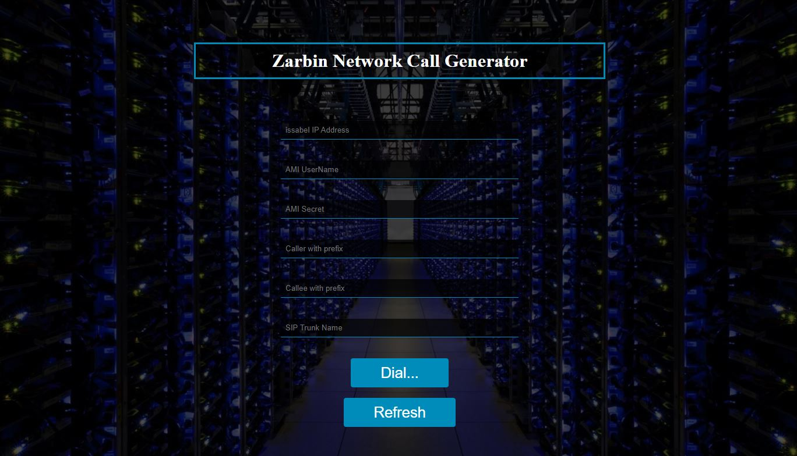

# issabel Call Generator
issabel Call Generator from Web with AMI Programming



1. Copy all downloaded file in `/var/www/html` directory on issabel
2. Set `775` or `777` permission to `callgen.php`
3. Create AMI User on `/etc/asterisk/manager_custom.conf` 
> UserName is : test

> Secret is : 123456
```
[test]
secret = 123456
deny=0.0.0.0/0.0.0.0
permit=0.0.0.0/0.0.0.0
read = system,call,log,verbose,command,agent,user,config,dtmf,reporting,cdr,dialplan
write = system,call,log,verbose,command,agent,user,config,command,reporting,originate
```
4. Reload Asterisk AMI
```bash script
asterisk -r
manager reload
exit
```
5. Open `https://issabel_IP_Address/callgen.php` and fill like this:

| issabel IP Address  | AMI UserName | AMI Secret | Caller with prefix | Callee with prefix | SIP Trunk Name |
| :-------------: | :-------------: | :-------------: | :-------------: | :-------------: | :-------------: |
| 192.168.1.10 | test  | 123456 | 90912XXXXX | 90935XXXXX | TCI
